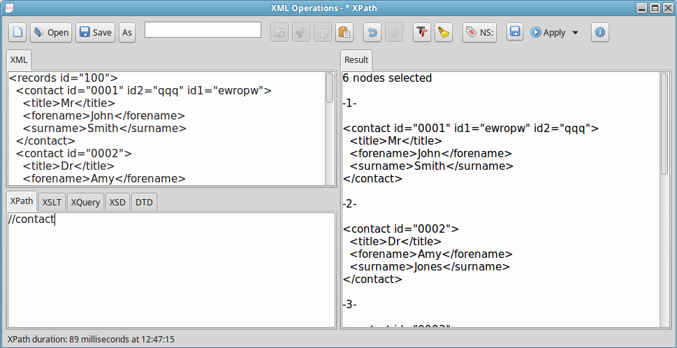
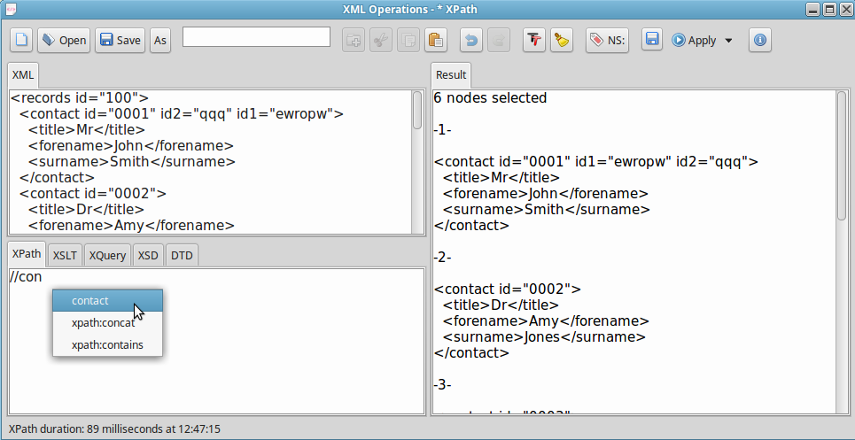
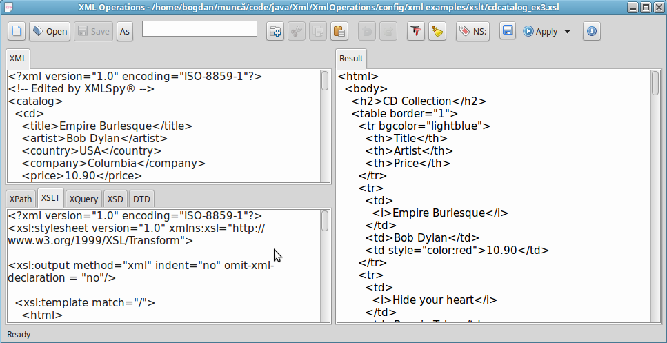
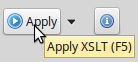
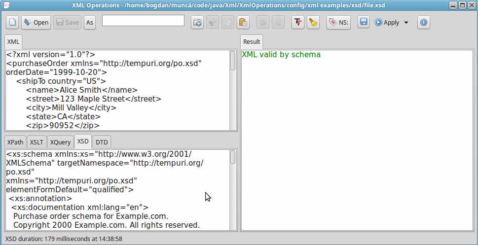
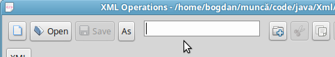
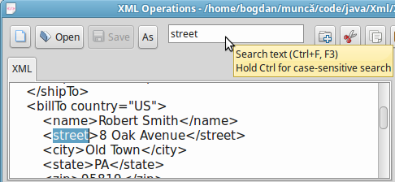

# XML Operations

This application facilitates the testing of selecting, transforming or validating operations on XML files or structures. It supports XPath, XSLT, XQuery, XSD and DTD.

## Contents
* [Selecting](#selecting)
* [Transforming](#transforming)
* [Validating](#validating)
* [Text Searching](#searching)
* [Project Setup](#setup)
* [Download and Run](#download)

## Selecting

First set the focus on the **XML** area and load or write there the target XML code, then move to **XPath** and press Enter.

The results are displayed on the right side panel:

While writing the command it is possible to press **Control + Space** and get it autocompleted or see a list of suggestions:

## Transforming

Write a new code in the dedicated tab (**XSLT** or **XQuery**) or load an already existing file from disk:

Then hit **F5** or press **Apply** to see the results:

## Validating

Proceed as above for writing or loading the **XSD** or **DTD** code, then hit the same **F5** to validate:

## Text Searching

Follow these steps in order:

1. Focus on the editing area you want to search into (any of them can be searched)
2. Focus on the searching textbox at the top of the application window (**Control + F**):

3. Write the search word and press Enter:

Repeat the (wrapped-style) search by pressing **F3**.

# Project Setup

Clone the [Commons](https://github.com/bogdanrechi/Commons) and [SwtCommons](https://github.com/bogdanrechi/SwtCommons) projects and install them in the local Maven repository.

You have to configure the location of the log files as in [log4j2.json](config/working/log4j2.json) (see option `fileName`).
Depending on the system you are using, run [xmloperations.bash](config/xmloperations.bash) in a folder with the same contents as [working](config/working).

# Download and Run

As a prerequisite, [**Java SE 9**](http://www.oracle.com/technetwork/java/javase/downloads/jdk9-downloads-3848520.html) needs to be installed on your machine.

Download **XmlOperations** from one of the links below, unpack it and run the batch file:

[XmlOperations](https://ln.sync.com/dl/c7c600840/h5i3u6dy-p6cjizi3-v2z9gtpt-waj5t63q)
